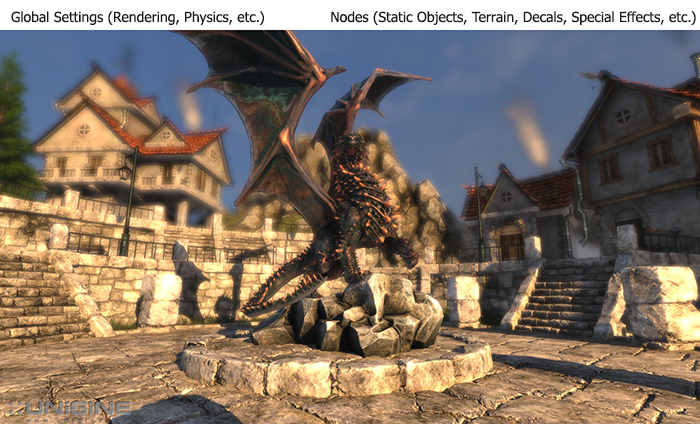
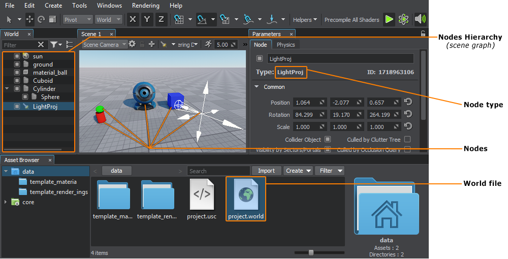
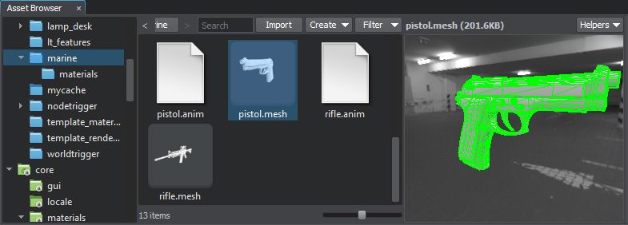
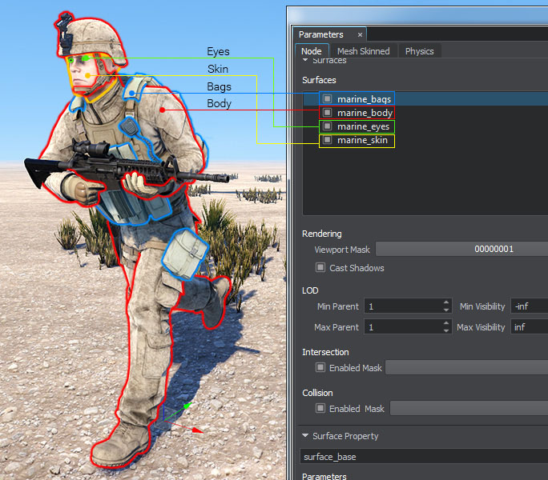
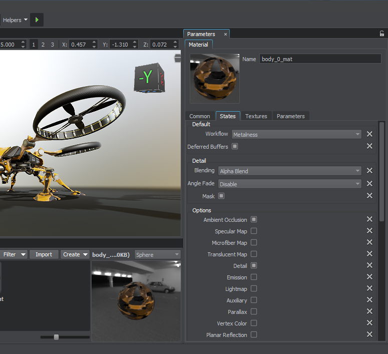
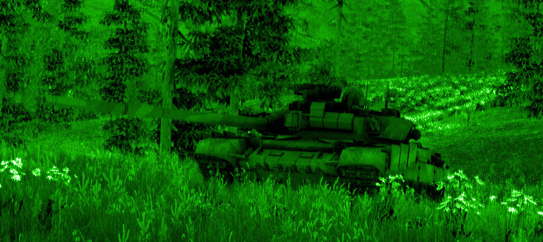
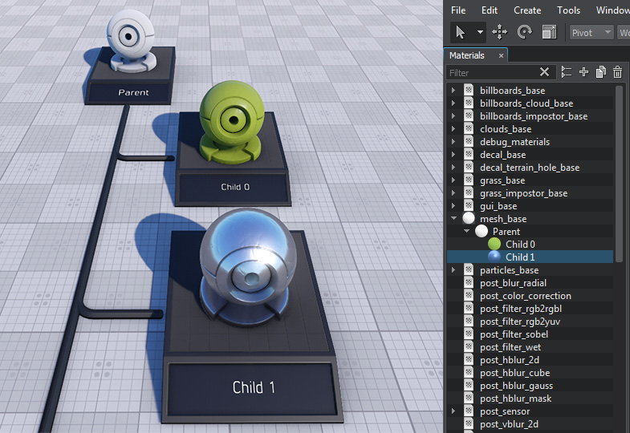
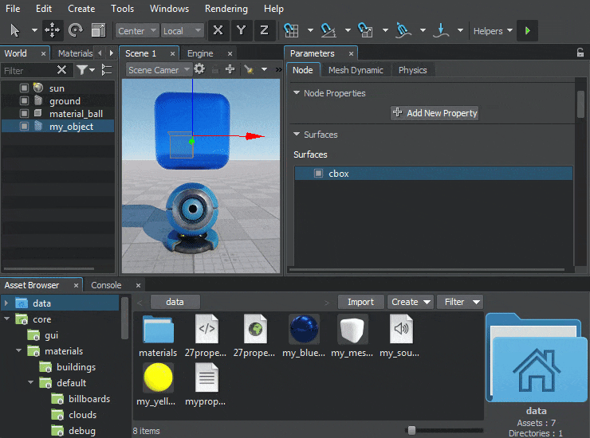
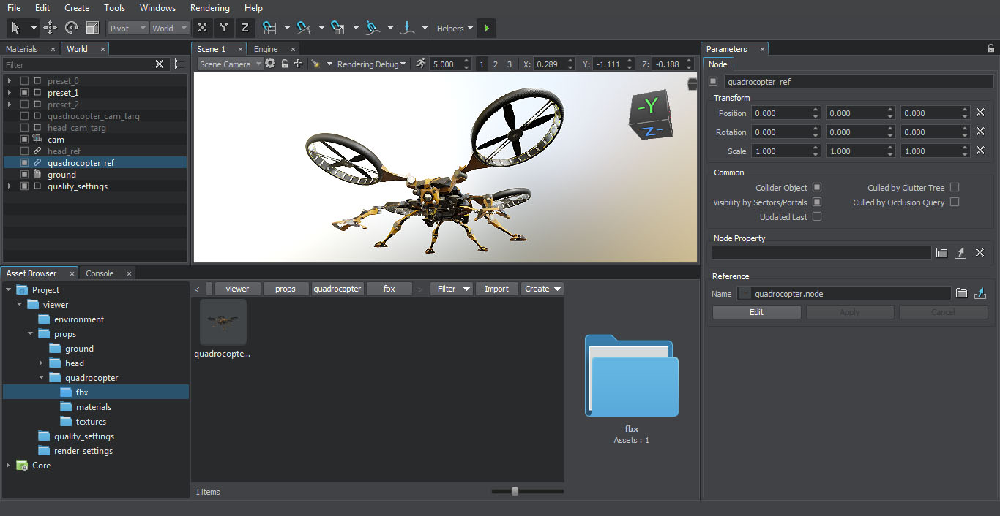

# 시작하기

- 원문 : Getting Started([링크](https://developer.unigine.com/en/docs/2.11/start/?rlang=cpp))
- 버전 : 2.11

[#입문자용](../태그별%20문서%20정리/입문자용.md)

이 문서는 유니진(Unigine) 관련 용어 및 개념을 다루며 모든 신규 사용자에게 적극 권장됩니다.

> **Notice**   
> [하드웨어 요구사항](./시스템%20요구사항.md) 문서를 확인해주세요.

## 가상 세계는 어떻게 구성되는가?

### 프로젝트

유니진에서 응용 프로그램을 생성하면 [프로젝트](../SDK%20브라우저/프로젝트.md)로 나타납니다. 프로젝트는 응용 프로그램의 [코드](../프로그래밍/프로그래밍.md), [콘텐츠](../콘텐츠%20제작/콘텐츠%20제작.md) 및 메타 데이터를 위한 "컨테이너"입니다.

프로젝트는 [월드](#월드)라고 부르는 하나 이상의 복잡한 3D 씬(Scene)으로 구성될 수 있습니다.

모든 프로젝트는 [UNIGINE SDK 브라우저](../SDK%20브라우저/SDK%20브라우저.md)를 통해서 [관리](./프로젝트%20워크플로우.md)됩니다.

### 월드

유니진 기반의 가상 [월드](../유니진%20에디터/월드%20관리하기.md)는 지정된 위치에 배치된 다른 씬 그래프 [노드](#노드) 세트(예 : 정적 메시, 조명, 카메라 등) 및 전체 씬에 적용된 전역 **설정**([렌더링](#렌더링), [물리](#전역%20물리%20설정) 등)이 포함된 3D 씬입니다.

유니진의 씬 그래프는 노드의 [멀티-루트 트리](../작동%20원리/가상%20월드%20구조.md#노드%20계층구조)(multi-root tree, 계층구조)입니다.

각 월드는 확장자가 ***.world***인 XML파일로 표시됩니다.

SDK 브라우저를 통해 새 [프로젝트](#프로젝트)를 만들면 프로젝트와 같은 이름으로 새로운 월드가 만들어집니다.

기존 월드를 편집하고 새로운 월드를 만들려면 [유니진 에디터](#유니진%20에디터)를 사용하십시오. 필요한만큼 많은 월드를 만들고 사용할 수 있습니다.

*노드와 월드는 유니진 에디터에서 볼 수 있습니다.*

### 노드

유니진의 관점에서 씬에 추가된 모든 객체를 **노드**라고 합니다. 노드는 시각적 표현과 동작을 결정하는 다양한 타입일 수 있습니다.

다양한 [빌트-인 노드](../빌트-인%20노드%20타입/빌트-인%20노드%20타입.md)(Built-in Nodes) 타입이 있습니다. 빌트-인 노드들은 거의 모든 필요한 경우를 다루지만 사용자가 수동으로 확장할 수 있습니다.

**[컴포넌트](../작동%20원리/컴포넌트%20시스템/컴포넌트%20시스템.md)**(Components)를 추가하여 모든 노드의 기본 기능을 확장할 수도 있습니다.

모든 노드에는 월드에서 노드의 위치, 회전 및 스케일을 인코딩하는 [변환 매트릭스](../프로그래밍/기초/행렬%20변환.md)가 있습니다.

[오브젝트](../빌트-인%20노드%20타입/오브젝트/오브젝트.md), [데칼](../빌트-인%20노드%20타입/데칼/데칼.md) 및 [이펙트](../빌트-인%20노드%20타입/이펙트/이펙트.md)와 같이 시각적으로 나타나는 노드와 [광원](../빌트-인%20노드%20타입/광원/광원.md), [플레이어](../빌트-인%20노드%20타입/플레이어/플레이어.md)처럼 보이지 않는 노드 타입이 있습니다.

노드 매개변수는 정기적으로 ***.world*** 파일에 저장되지만 ***.node*** 확장자를 가진 별도의 XML 파일로 저장될 수 있습니다(그리고 나중에 [노드 인스턴싱](../유니진%20에디터/인스턴싱%20노드.md)에 사용되는 특수 노드인 [노드 레퍼런스](../빌트0인%20노드%20타입/노드/노드%20레퍼런스.md)(Node Reference)를 통해 ***.world*** 파일에서 참조될 수 있습니다).

#### 오브젝트

가장 중요한 노드 타입 중 하나는 [오브젝트](../빌트-인%20노드%20타입/오브젝트/오브젝트.md)(Object)입니다. 오브젝트는 실제 세계에 존재하는 개체(사람, 나무, 자동차, 비행기 등), 하늘, 지형, 물 등을 모방하여 표현합니다. 오브젝트에는 시각적 형태를 정의하는 단일 [서피스](#서피스(Surface))(Surface, 표면) 또는 서피스의 집합이 있습니다. 3D 공간에서 차지하는 부피와 물리적 상호작용에 참여하는 [바디](#바디(Body))(Body, 몸체)를 나타내는 [셰이프](#셰이프(Shape))(Shape, 형태)를 가질 수 있습니다.

### 메시(Mesh)

**메시**는 오브젝트의 지오메트리를 정의하는 폴리곤의 모음입니다. 다음과 같은 속성을 가지고 있습니다:

- 각 메시에는 하나 이상의 [서피스](#서피스(Surface))가 있습니다.
- 서피스당 최대 폴리곤 수는 **2,147,483,647개**([ObjectMeshStatic](../빌트-인%20노드%20타입/오브젝트/스태틱%20메시.md), [ObjectMeshSkinned](../빌트-인%20노드%20타입/오브젝트/스킨드%20메시.md)) 또는 **65,535개**([ObjectMeshDynamic](../빌트-인%20노드%20타입/오브젝트/다이나믹%20메시.md)) 입니다.
- 텍스쳐링을 위한 2개의 UV채널이 있습니다.
- 메시는 버텍스 컬러를 지원합니다.

유니진의 애니메이션은 본 기반(Bone-based)의 [스킨드 메시](../빌트-인%20노드%20타입/오브젝트/스킨드%20메시.md), 키프레임(Keyframe)으로 동작하는 [모프 타깃](../콘텐츠%20제작/튜토리얼/모프%20타깃%20추가하기.md)(morph targets) 또는 코드로 제어되는 [다이나믹 메시](../빌트-인%20노드%20타입/오브젝트/다이나믹%20메시.md)를 통해서 수행할 수 있습니다.

런타임(run-time) 중에 메시는 ***.mesh***(스태틱 메시 + 선택된 애니메이션 데이터) 및 ***.anim***(외부 애니메이션 데이터) 확장자를 가진 고유한 유니진 [포맷](../프로그래밍/파일%20포맷/메시%20파일%20포맷.md)으로 저장됩니다.

[FBX 모델을 엔진에 임포트](../유니진%20에디터/에셋%20워크플로우/에셋%20생성%20및%20임포트/FBX%20임포트%20가이드.md)하면 자동으로 ***.mesh*** 포맷으로 변환됩니다.

> **Notice**  
> 오브젝트의 일부에 다른 머티리얼(예 : 투명(transparent)/불투명(opaque), 반짝이는 금속/인간의 피부)를 넣으려면 메시를 서피스로 분할해야 합니다. 그러나 지오메트리의 일부를 개별적으로 이동시키려면(예 : 자동차의 바퀴) 여러 개의 개별 메시가 필요합니다.

### 서피스(Surface)

**서피스**는 오브젝트 지오메트리(즉, 오브젝트 메시)의 이름이 겹치지 않는 부분 집합(subset)입니다. 각 서피스에는 고유한 [머티리얼](#머티리얼(Material))이나 [프로퍼티](#프로퍼티)가 할당될 수 있습니다. 서피스를 서로 독립적으로 활성화/비활성화할 수도 있습니다.

서피스는 메시 내 [계층구조](../작동%20원리/가상%20월드%20구조.md#서피스(Surfaces))로 구성할 수 있습니다(이것을 [LOD](#LOD) 전환에 사용할 수 있습니다).

아래의 그림에서 군인 3D 메시는 눈, 피부, 가방(방탄복, 라디오 세트, 가방) 및 몸(전체, 신발, 방탄모, 장갑)의 4가지 서피스로 구성됩니다.

### 머티리얼(Material)

유니진에서의 머티리얼은 서피스의 모양, 광원과의 상호작용, 반사 매개변수 등을 결정하는 규칙입니다. 이 규칙은 다음을 기반으로 합니다 :

- 다양한 조건에 따라 머티리얼을 그리는 정점(vertex), 프래그먼트(fragment) 및 지오메트리(geometry) **셰이더**;
- 셰이더에 전달되는 사용자 지정 **텍스쳐**;
- 적절한 셰이더가 적용될 조건을 지정하는 **상태**;
- 셰이더 사용 방법을 결정하는 **매개변수**;

유니진은 다양한 **[빌트-인 기본 머티리얼](../콘텐츠%20제작/머티리얼/머티리얼.md)**(built-in based materials)을 제공합니다. 권장하는 방법은 기본 머티리얼을 새로운 사용자 머티리얼에 상속하고 조정하는 것입니다. UUSL([Unified UNIGINE Shader Language](../프로그래밍/UUSL/UUSL.md))또는 HLSL/GLSL을 사용하여 사용자 지정 셰이더를 만들 수도 있지만, 후자의 경우 모든 SDK 릴리즈에서 사용자 지정 셰이더를 직접 마이그레이션해야합니다.

특정 서피스에 적용되는 일반 머티리얼 외에도 <b>[포스트 머티리얼](../콘텐츠%20제작/머티리얼/빌트-인%20기본%20머티리얼/포스트프로세스%20머티리얼/포스트프로세스%20머티리얼.md)</b>이라고 부르는 특수한 유형의 머티리얼이 최종 화면 구성 위에 적용됩니다(예 : 야간 또는 열화상 카메라 효과 생성). [커스텀 포스트 머티리얼과 커스텀 셰이더](../프로그래밍/UUSL/포스트-프로세싱을%20위한%20커스텀%20셰이더%20만들기.md)로 나만의 포스트 이펙트를 만들 수도 있습니다. 

#### 머티리얼 계층구조(Material Hierarchy)

머티리얼은 매개변수 상속과 오버로딩(객체 지향 프로그래밍과 유사)을 통한 [계층구조](../콘텐츠%20제작/머티리얼/계층구조와%20상속.md)로 구성됩니다. 머티리얼이 상속되면 모든 매개변수가 부모 머티리얼에서 상속됩니다. 부모 머티리얼에 대한 매개변수 값이 변경되면 그 전에 자식 머티리얼에서 재정의되지 않은 경우(다른 값으로 변경되지 않는 한) 자식 머티리얼에서도 자동으로 변경됩니다.

예시 : 머티리얼 A에는 두 가지 매개변수(color : 파란색과 spcular power : 1.4)가 있고 머티리얼 B는 머티리얼 A를 상속받으며 color 매개변수가 빨간색으로 재정의됩니다. 이 상태에서 머티리얼 A에서 specular power의 값을 2.0으로 변경하면, 머티리얼 B는 다음과 같은 파라미터를 갖게 됩니다 : color - 빨간색(재정의됨), specular power - 2.0(상속됨)

매개변수 상속을 사용하면 여러 머티리얼 매개변수의 값을 대량 제어하는 것이 매우 편리해집니다.

### 프로퍼티

<b>[프로퍼티](../작동%20원리/프로퍼티/프로퍼티.md)</b>는 응용 프로그램 논리의 "재료"입니다. 오브젝트의 동작과 다른 오브젝트 및 씬 환경과 상호작용하는 방식을 지정합니다. 프로퍼티는 캐릭터의 히트 포인틀르 나타내는 간단한 정수부터 노드, 머티리얼, 파일(텍스쳐, 메시, 사운드 등) 또는 프로퍼티에 이르기까지 다양한 유형의 매개변수를 가질 수 있으며, 이는 다양한 리소스에 대한 접근은 단순화합니다.

프로퍼티는 노드의 기능을 확장하기 위해 <b>[컴포넌트](../작동%20원리/컴포넌트%20시스템/컴포넌트%20시스템.md)</b>를 빌드하는 데 사용될 수 있습니다.

프로퍼티는 머티리얼과 같이 매개변수 상속을 사용하는 [계층구조](../작동%20원리/프로퍼티/계층구조와%20상속.md)로 구성됩니다. 그러나 머티리얼과 달리 *서피스* 또는 *노드마다* 적용할 수 있습니다.

## 어떻게 가상 월드에 콘텐츠를 추가하는가?

월드나 프로젝트에서 사용할 수 있는 모든 콘텐츠는 **에셋**입니다. 에셋은 3D 모델, 오디오 파일, 이미지 또는 유니진 엔진이 지원하는 기타 유형과 같은 타사 응용프로그램을 사용하여 만든 파일에서 가져올 수 있습니다.

에셋 시스템(Asset System)의 주요 프론트 엔드 도구는 [유니진 에디터](#유니진%20에디터)의 **[에셋 브라우저](../유니진%20에디터/에셋%20워크플로우/에셋%20워크플로우.md#에셋%20브라우저)**(Asset Browser)입니다. 에셋 브라우저는 프로젝트에서 콘텐츠를 구성하는데 사용됩니다 : 에셋 생성, 임포트, 보기, 이름 바꾸기, 폴더 간의 이동 및 계층구조 관리

[에셋을 생성하거나 임포트](../유니진%20에디터/에셋%20워크플로우/에셋%20생성%20및%20임포트/에셋%20생성%20및%20임포트.md)할 때마다 [유니진 에디터](../유니진%20에디터/유니진%20에디터.md)는 에셋(JPG 텍스쳐 또는 FBX 모델)을 런타임 중에 엔진에서 사용할 수 있도록 자체 포맷(예 : 압축된 ***.dds*** 텍스쳐, ***.mesh*** 지오메트리, ***.anim*** 애니메이션 등)으로 변환하는 등 필요한 모든 작업을 수행합니다. 변환 결과 생성된 이러한 파일을 "**런타일 파일(run-time files)**"이라고하며 해당 에셋을 수정할 때마다 유니진 에디터에 의해서 업데이트됩니다.

[에셋 워크플로우](../유니진%20에디터/에셋%20워크플로우/에셋%20워크플로우.md) 문서를 통해서 상세한 내용을 배울 수 있습니다.

### 유니진 에디터

<b>[유니진 에디터](../유니진%20에디터/유니진%20에디터.md)</b>를 사용하면 다음과 같은 작업을 통해 가상 월드를 구성할 수 있습니다 :
- 노드를 임포트하고 설정
- 머티리얼과 프로터티를 할당
- 광원 설정
- [전역 설정](../유니진%20에디터/설정%20및%20환경설정/설정%20및%20환경설정.md) 조정(물리, 렌더링 등)
여기에는 *WYSIWYG* 방식이 적용되어 (런타임에서와 같이)최종 품질로 씬을 즉시 볼 수 있습니다.

아래의 튜토리얼을 보고 3D 모델을 유니진에 임포트하는 방법을 알아보십시오:  
[Importing 3D Models - UNIGINE Editor 2 Essentials](https://youtu.be/L3SAlAYRQIE)

## 우리는 어떻게 가상 월드를 볼 수 있는가?

### 라이팅(Lighting)

### 렌더링

## 우리는 어떻게 소리를 듣는가?

## 물리 동작은 어떻게 정의되는가?

### 바디(Body)

### 셰이프(Shape)

#### 충돌 감지

### 조인트(Joint)

### 전역 물리 설정

## 가상 세계를 어떻게 컨트롤 하는가?

### 프로그래밍 언어

#### 혼합 언어

### 런-타임 로직

#### 컴포넌트 시스템

### 교차점 감지

### 샘플과 데모

## 어떻게 프로젝트의 성능을 최적화 하는가?

### LOD

### 비트 마스킹

- 원문 최종 업데이트 : 2020-04-27