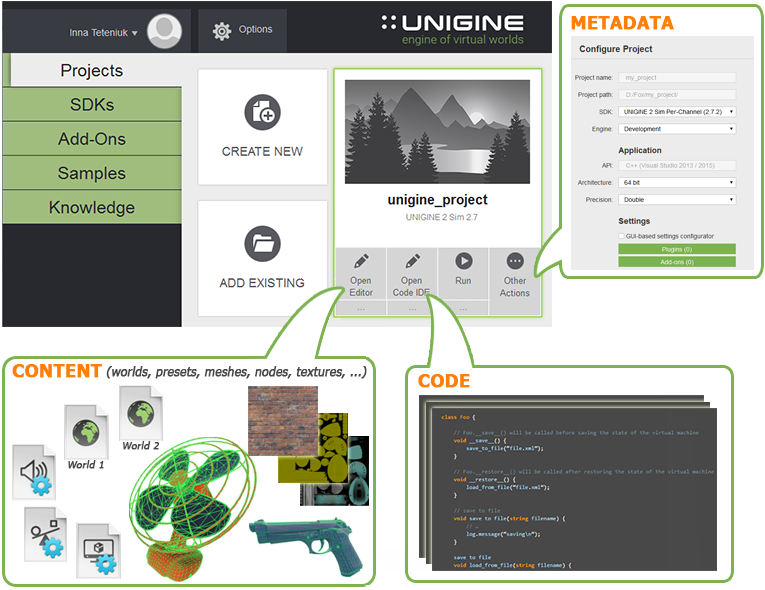

# 시작하기

[입문자용]

이 문서는 유니진(Unigine) 관련 용어 및 개념을 다루며 모든 신규 사용자에게 적극 권장됩니다.

> <b>Notice</b>   
> [하드웨어 요구사항](./시스템%20요구사항.md) 문서를 확인해주세요.

## 가상 세계는 어떻게 구성되는가?

### 프로젝트

유니진에서 응용 프로그램을 생성하면 [프로젝트](../SDK%20브라우저/프로젝트.md)로 나타납니다. 프로젝트는 응용 프로그램의 [코드](../프로그래밍/프로그래밍.md), [콘텐츠](../콘텐츠%20제작/콘텐츠%20제작.md) 및 메타 데이터를 위한 "컨테이너"입니다.

프로젝트는 [월드](###월드)라고 부르는 하나 이상의 복잡한 3D 장면으로 구성될 수 있습니다.

모든 프로젝트는 [UNIGINE SDK 브라우저](../SDK%20브라우저/SDK%20브라우저.md)를 통해서 [관리](./프로젝트%20워크플로우.md)됩니다.

### 월드